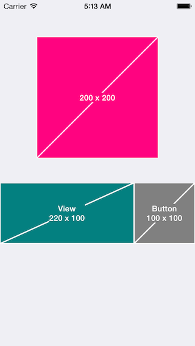

# Masu

[](https://travis-ci.org/midnightSuyama/Masu)
[](http://cocoadocs.org/docsets/Masu)
[](http://cocoadocs.org/docsets/Masu)
[](http://cocoadocs.org/docsets/Masu)

Placeholder for iOS prototyping



## Usage

To run the example project, clone the repo, and run `pod install` from the Example directory first.

```
// UIView demo
Masu *masu = [[Masu alloc] initWithFrame:CGRectMake(0, 300.0f, 220.0f, 100.0f)];
masu.backgroundColor = [UIColor colorWithRed:0 green:0.5f blue:0.5f alpha:1];
masu.text            = @"View";
[self.view addSubview:masu];

// UIImage demo
UIButton *btn = [UIButton buttonWithType:UIButtonTypeCustom];
[btn setFrame:CGRectMake(220.0f, 300.0f, 100.0f, 100.0f)];
[btn setImage:[Masu imageWithSize:btn.frame.size backgroundColor:[UIColor grayColor] labelText:@"Button"] forState:UIControlStateNormal];
[self.view addSubview:btn];
```

## Installation

Masu is available through [CocoaPods](http://cocoapods.org). To install
it, simply add the following line to your Podfile:

    pod "Masu"

## Author

midnightSuyama, midnightSuyama@gmail.com

## License

Masu is available under the MIT license. See the LICENSE file for more info.

